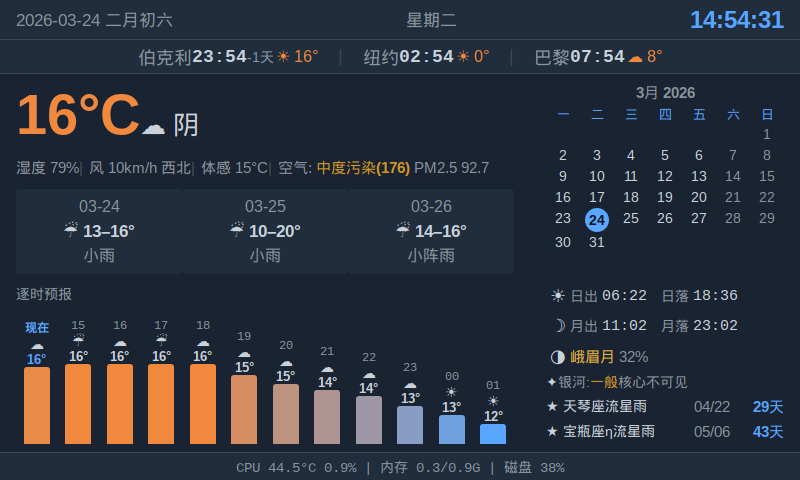

# Info-Pi

[English](#english) | 中文

树莓派信息看板 -- 在 800x480 屏幕上显示天气、日历、天文和系统状态。基于 Flask 和原生 HTML/CSS/JS，无需构建工具。



## 功能

- **实时天气** -- 温度、湿度、风速、体感温度、空气质量 (PM2.5)
- **三天预报** -- 天气图标与温度范围
- **12 小时逐时预报** -- 温度柱状图与天气图标
- **月历** -- 高亮今日，标注中国法定节假日（红色）和调休工作日（金色）
- **农历日期** -- 自动转换并显示在公历日期旁
- **天文数据** -- 日出/日落、月出/月落、月相、银河可见性
- **天文事件** -- 流星雨与日月食倒计时
- **世界时钟** -- 伯克利、纽约、巴黎及当地温度
- **系统状态** -- CPU 温度、CPU/内存/磁盘使用率
- **昼夜主题** -- 背景色根据日出日落自动渐变，含 30 分钟晨昏过渡

天气数据来自 [Open-Meteo](https://open-meteo.com/)（免费，无需 API 密钥）。

## 快速开始

```bash
# 克隆并安装
git clone https://github.com/lxidea/info-pi.git
cd info-pi
python3 -m venv venv
venv/bin/pip install -r requirements.txt

# 本地运行
python3 app.py
# 打开 http://localhost:5000
```

## 部署到树莓派

```bash
# 一键部署（安装 systemd 服务并启动）
bash deploy/deploy.sh pi@<树莓派IP>
```

将安装两个 systemd 服务：
- `info-pi.service` -- Flask 服务（端口 5000）
- `kiosk.service` -- Chromium 全屏 kiosk 模式

### 前置条件

- 带显示屏的树莓派（针对 800x480 优化）
- Raspberry Pi OS 桌面版（用于 Chromium kiosk 模式）
- Python 3.7+
- 网络连接（用于天气 API）

## 配置

编辑 `config.py` 自定义：

```python
# 你的位置（Open-Meteo 天气接口使用的经纬度）
WEATHER_LAT = 30.59    # 默认：中国武汉
WEATHER_LON = 114.30

# 刷新间隔（秒）
WEATHER_INTERVAL = 900  # 15 分钟
```

世界时钟城市可在 `collectors/datetime_info.py` 中修改。

## 许可证

MIT

---

<a id="english"></a>

# Info-Pi

English | [中文](#info-pi)

A Raspberry Pi kiosk dashboard that displays weather, calendar, astronomy, and system stats on an 800x480 screen. Built with Flask and plain HTML/CSS/JS -- no build tools required.


## Features

- **Current weather** -- temperature, humidity, wind, feels-like, air quality (PM2.5)
- **3-day forecast** with weather icons and temperature ranges
- **12-hour hourly timeline** with temperature bars and weather icons
- **Monthly calendar** with today highlight, Chinese public holidays (red) and makeup workdays (gold)
- **Lunar calendar** -- automatic solar-to-lunar date conversion displayed alongside Gregorian date
- **Astronomy data** -- sunrise/sunset, moonrise/moonset, moon phase, Milky Way visibility
- **Upcoming events** -- meteor showers and eclipses with countdown
- **World clocks** -- Berkeley, New York, Paris with local temperatures
- **System stats** -- CPU temperature, CPU/RAM/disk usage
- **Day/night theme** -- background color transitions based on sunrise/sunset with 30-minute dawn/dusk blending

Weather data is fetched from [Open-Meteo](https://open-meteo.com/) (free, no API key required).

## Quick Start

```bash
# Clone and set up
git clone https://github.com/lxidea/info-pi.git
cd info-pi
python3 -m venv venv
venv/bin/pip install -r requirements.txt

# Run locally
python3 app.py
# Open http://localhost:5000
```

## Deploy to Raspberry Pi

```bash
# One-command deploy (installs systemd services, starts everything)
bash deploy/deploy.sh pi@<your-pi-ip>
```

This sets up two systemd services:
- `info-pi.service` -- Flask server on port 5000
- `kiosk.service` -- Chromium in fullscreen kiosk mode

### Prerequisites (Pi)

- Raspberry Pi with a display (optimized for 800x480)
- Raspberry Pi OS with desktop (for Chromium kiosk mode)
- Python 3.7+
- Network access for weather API

## Configuration

Edit `config.py` to customize:

```python
# Your location (latitude/longitude for Open-Meteo weather)
WEATHER_LAT = 30.59    # default: Wuhan, China
WEATHER_LON = 114.30

# Refresh intervals (seconds)
WEATHER_INTERVAL = 900  # 15 minutes
```

World clock cities can be changed in `collectors/datetime_info.py`.

## Architecture

```
info-pi/
  app.py              # Flask app -- serves / and /api/all
  config.py           # Location, intervals, Flask settings
  collectors/
    weather.py        # Open-Meteo API (current + hourly + forecast + astronomy)
    datetime_info.py  # Date, time, lunar calendar, world clocks
    astronomy_events.py  # Meteor showers & eclipses (2024-2030)
    holidays.py       # Chinese public holidays & makeup workdays
    system_stats.py   # CPU/RAM/disk via psutil
    network.py        # IP/ARP/bandwidth (available, not wired in)
  templates/
    index.html        # Single-page dashboard
  static/
    css/dashboard.css  # Dark theme, 800x480 layout
    js/dashboard.js    # Fetches /api/all every 5s, updates DOM
  deploy/
    deploy.sh         # rsync + systemd setup script
    info-pi.service   # Flask server systemd unit
    kiosk.service     # Chromium kiosk systemd unit
    kiosk.sh          # Chromium launch script
```

**Data flow:** The frontend polls `/api/all` every 5 seconds. Weather data is fetched in a background thread every 15 minutes; other collectors run synchronously per request.

## UI Language

The dashboard UI is in **Chinese (zh-CN)** -- weather descriptions, date formats, labels, and moon phase names are all in Chinese.

## License

MIT
